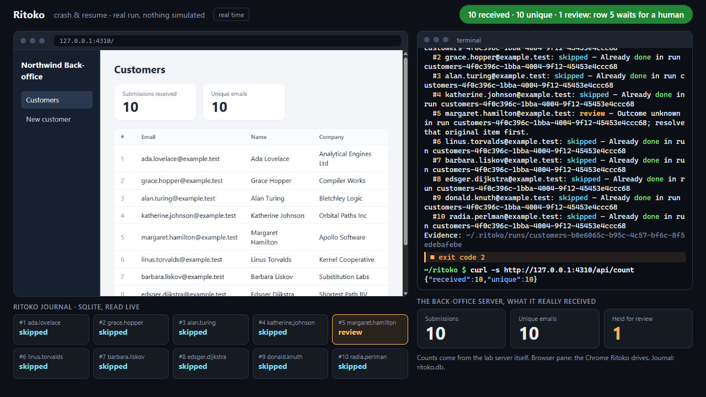
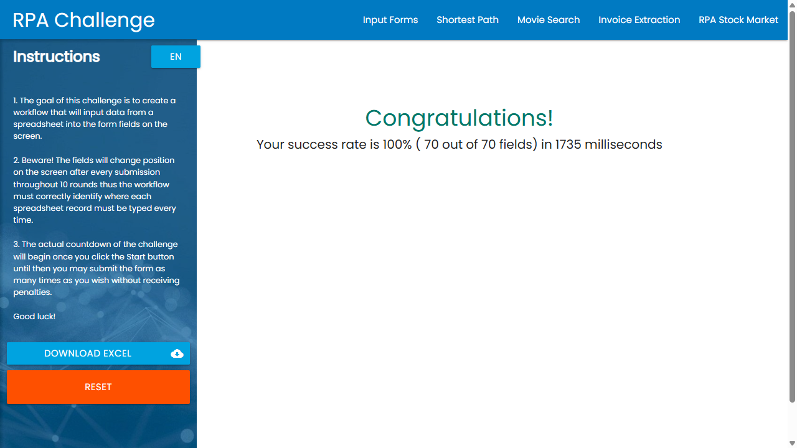

<!-- mcp-name: io.github.Swih/ritoko -->

# Ritoko — resumable browser automation for AI agents

**Solve a task once. Save the procedure. Run it again with new data.**

Ritoko is an open-source browser automation and robotic process automation (RPA) tool for AI agents. Turn a solved task into a reusable browser, HTTP API or MCP workflow, run CSV or Excel batches, verify results and resume interrupted work with a local SQLite journal.

Use it as a **Claude Code or Codex plugin**, a **local Model Context Protocol (MCP) server**, or a **standalone CLI**. The direct replay engine runs saved workflows without calling an LLM; a connected MCP tool may itself use AI.

[](https://github.com/Swih/ritoko/actions/workflows/ci.yml)
[](https://www.npmjs.com/package/ritoko)
[](https://nodejs.org/)
[](LICENSE)

[Try locally](#try-ten-fake-customers-locally) · [Quick start](#quick-start) · [Use cases](#what-can-you-automate) · [How it works](#how-it-works) · [Workflow example](#what-does-a-workflow-look-like) · [FAQ](#faq) · [Advanced guide](docs/usage.md)

[](https://github.com/Swih/ritoko/raw/refs/heads/main/site/assets/media/demo.mp4)

**[Watch the 34-second demo](https://github.com/Swih/ritoko/raw/refs/heads/main/site/assets/media/demo.mp4)** — real-time execution against a local test application. Kill the process after the fifth submission, resume, then rerun the same CSV: 10 submissions received, 10 unique, one row still awaiting confirmation. [Recorded results and environment](site/assets/media/facts.json).

## Why use Ritoko?

An agent can figure out how to enter a customer, download a report or call a business tool. A recurring batch also needs an input format, a rule for identifying each record, a success check and a way to recover after interruption.

Ritoko keeps those decisions in a reusable procedure:

- **Reuse the work.** Save parameters, selectors, API calls and verification rules in a readable JSON workflow.
- **Process new data.** Feed the procedure another CSV or Excel file instead of explaining the same steps for every row.
- **Recover with evidence.** See which items finished, failed or have an uncertain outcome. Confirmed items are skipped on later runs; uncertain writes are held for review.

With a configured destination lookup, Ritoko can also **check before creating a record** (`ensure`) and **settle an uncertain result by reading it back** (`reconcile`). These 0.2.0 features require a direct HTTP GET or a trusted, explicitly read-only MCP tool, with separate rules proving presence and absence. A failed lookup blocks the row. [Configuration and limits](docs/usage.md#destination-lookup-ensure-and-reconcile).

For example: teach your agent to create one customer, save `customer-import`, then ask it to process next week's spreadsheet and report each result.

## What can you automate?

| Task | Input | What the workflow does |
| --- | --- | --- |
| Customer or supplier onboarding | CSV / Excel rows | Fill forms, submit each record and check its identifying details |
| Recurring report downloads | Account and period parameters | Open the report, wait for it and save the downloaded file |
| Back-office data exports | An HTML or ARIA table | Extract the rendered table to CSV for a later batch |
| HTTP API operations | Rows, parameters and environment-backed credentials | Send requests, check status and JSON results, save response files |
| Existing MCP tools | Rows and tool arguments | Call tools and check their returned data under the same journal rules |
| Mixed browser and API tasks | A spreadsheet plus workflow parameters | Pass saved values and files between supported browser, HTTP and MCP steps |

Ritoko fits **repeated tasks with explicit rules and verifiable outcomes**. A new task still needs an agent or a workflow author to understand the site and define the procedure.

## Quick start

### Try ten fake customers locally

With **Node.js 24+**, in an empty directory:

```sh
npm install ritoko@0.2.0
node node_modules/ritoko/examples/first-run/demo.mjs
```

The demo starts a loopback HTTP service, creates ten fake CSV customers, verifies each record by reading it back, then reruns and checks that all ten rows are skipped with no extra writes. It needs no account, API key or Chrome. The journal is isolated in a temporary directory printed by the command. This tests a local simulation; browser interruption and destination reconciliation are separate tests. [English/French guide and expected results](docs/first-run.md).

The npm example requires a published 0.2.0. If that version is not yet available in your registry, use the repository checkout instructions in the guide to try it from source.

### 1. Install in your agent

Requires **Node.js 24 or newer**. Browser workflows using the direct runner also need **Google Chrome**. Standalone HTTP/MCP workflows can run without a browser.

`ensure`, `reconcile`, `doctor` and the first-try demo require **0.2.0 or newer**. Check the [versioned releases](https://github.com/Swih/ritoko/releases) and [release gates](docs/release.md#020-release) before upgrading a pinned installation.

**Claude Code**

```bash
claude plugin marketplace add Swih/ritoko
claude plugin install ritoko@ritoko
```

**Codex CLI**

```bash
codex plugin marketplace add Swih/ritoko
codex plugin add ritoko@ritoko
```

Restart the client after installation. The Git plugin includes the agent skill and a local MCP server; its launcher installs pinned runtime dependencies on first start, with npm lifecycle scripts disabled.

For long Codex batches, configure the [tool-call timeout](docs/usage.md#long-running-tool-calls) before running.

<details>
<summary><strong>Other local MCP clients</strong></summary>

Add this stdio server configuration to a client that supports local MCP processes:

```json
{
  "mcpServers": {
    "ritoko": {
      "command": "npx",
      "args": ["--yes", "--prefer-online", "ritoko@latest", "mcp"]
    }
  }
}
```

This uses the latest **published npm release**. Git marketplace installs use their Git revision, which may be newer. For repeatable production runs, pin a published version and test upgrades on a small batch.

Also load the [Ritoko agent skill](skills/ritoko/SKILL.md) if your client supports skills. Claude Code and Codex CLI are the tested plugin clients; other clients need their own compatibility checks. See [client setup](docs/usage.md#use-with-other-agents).

</details>

### 2. Choose the browser or integration

Tell the agent which browser you want it to use. The direct runner connects to personal Chrome after you enable remote debugging at `chrome://inspect/#remote-debugging` and allow the connection. Choose `RITOKO_BROWSER=clean` explicitly for a separate profile.

A compatible agent browser can execute host workflows when it permits page-script execution. **Codex's current computer-use `evaluate` is read-only, so it cannot execute host browser replay.** Host API-only and connected MCP-tool batches remain available. See [browser selection and trust boundaries](docs/usage.md#cli-and-browser-selection).

### 3. Teach one task, then reuse it

Ask your agent:

> Record a customer import with Ritoko on this back office. Use the browser I selected. Save it as `customer-import` with an `input` spreadsheet parameter. Use Email as the business key and verify the created customer's email.

If the demonstration created a real record, the agent should **adopt that already submitted row** with `run_adopt` and evidence before replaying the batch.

Then:

> Run `customer-import` on the same back office with `input` set to the absolute path of `customers.csv`. Show me the confirmed, failed and review items, plus any saved files.

Later:

> Resume my last Ritoko run.

> Show the report for my last run and explain which items still need review.

## How it works


1. **Define.** The agent records browser actions or writes supported API/MCP steps. The recorder prefers unique labels, roles and other meaningful selectors; fragile positional selectors are flagged.
2. **Save.** The workflow declares its parameters, input, business key, submission boundary (`commit`) and result checks (`expect`).
3. **Replay.** The direct engine executes the saved steps. Host mode lets a compatible agent execute supported browser actions or connected tools.
4. **Journal and recover.** SQLite keeps each run's workflow and input rows. A resumed batch uses that snapshot, even if the original spreadsheet changes. A changed page can pause for repair; an uncertain submission stays held for review.

### What happens after a failure?

| Item status | Meaning | Next action |
| --- | --- | --- |
| `done` | The workflow's checks passed | Kept on resume; normally skipped in a later run |
| `failed` | Failed before submission | Retry safe failures when resuming; conflicting data is blocked |
| `review` | The write may have happened | Check the actual business result and resolve with evidence |
| `skipped` | Already confirmed under the same workflow, scope and key | No new submission |

A run is complete only when its items are confirmed or skipped and its final checks pass. A partial result or repair pause is visible in the report and returns CLI exit code `2`.

**Verification quality matters.** A receipt, record ID or matching customer email can prove the intended result. A generic “Success” banner usually cannot. The journal tracks this Ritoko installation; it cannot prevent independent submissions or guarantee that a remote site is idempotent.

## What does a workflow look like?

This illustrative browser workflow creates one customer per spreadsheet row. Adapt the URL, labels and result selector to your application before saving it.

```json
{
  "name": "customer-import",
  "version": 1,
  "description": "Create customers and verify their email.",
  "params": {
    "base": { "description": "Back-office base URL" },
    "input": { "description": "Absolute CSV or XLSX path" }
  },
  "items": {
    "from": "{{param.input}}",
    "key": "{{item.Email}}",
    "scope": "{{param.base}}"
  },
  "item": [
    {
      "do": "goto",
      "url": "{{param.base}}/customers/new"
    },
    {
      "do": "fill",
      "target": { "primary": { "by": "label", "text": "Email" } },
      "value": "{{item.Email}}"
    },
    {
      "do": "click",
      "target": {
        "primary": { "by": "role", "role": "button", "name": "Create customer" }
      },
      "commit": true
    },
    {
      "do": "expect",
      "target": { "primary": { "by": "testid", "id": "customer-email" } },
      "text": "{{item.Email}}"
    }
  ]
}
```

`key` identifies the business record; this example's `scope` separates destination URLs. Include the account identifier in the scope if several accounts share a URL. The `commit` marks the irreversible action, and the following `expect` checks that specific row. Read-only batches declare `readOnly: true`.

See [complete example workflows](examples), the [workflow schema](src/engine/schema.ts) and the [HTTP/MCP reference](skills/ritoko/reference.md#api-and-mcp-steps).

## Use the CLI without an agent

From a Git checkout, the launcher can import and run an existing workflow without an agent or an LLM API key:

```bash
git clone https://github.com/Swih/ritoko.git
cd ritoko
node bin/ritoko.mjs import examples/rpa-challenge.json
node bin/ritoko.mjs run rpa-challenge
node bin/ritoko.mjs report
```

The RPA Challenge example downloads its own Excel input. Choose the direct browser as described above before running it. To intentionally run this same challenge again, add `--repeat`; review holds remain blocked.

For an interrupted direct run, use `node bin/ritoko.mjs resume <runId>`. Workflows, journals, evidence and output files live in `~/.ritoko` by default; override with `RITOKO_HOME`.

Use `node bin/ritoko.mjs doctor` to inspect the local setup before troubleshooting a batch. For a review row with a configured destination lookup, `node bin/ritoko.mjs reconcile <runId> <key>` reads the result without submitting it again. Manual `resolve` requires a note and `--confirm-checked` after you inspect the destination yourself.

## Evidence and current scope

| Validation | Observed result | Evidence |
| --- | --- | --- |
| Live RPA Challenge | 10 rows, 70/70 fields, 100% score; site timer 1.735 s | [Screenshot](site/assets/media/rpa-challenge-100.png), [workflow](examples/rpa-challenge.json) |
| Local crash-and-resume demo | Process killed after submission 5; 10 unique submissions after recovery; 9 confirmed, 1 held for review | [Video](https://github.com/Swih/ritoko/raw/refs/heads/main/site/assets/media/demo.mp4), [recorded facts](site/assets/media/facts.json) |
| Automated checks | Unit tests and real-Chrome E2E jobs configured for Windows, Linux and macOS | [CI workflow and runs](https://github.com/Swih/ritoko/actions/workflows/ci.yml), [release gates](docs/release.md) |

The recorded demos used Ritoko 0.1.0 on Windows with headless Chrome. The RPA site's timer excludes installation and setup; the recorded CLI wall time was 3.559 s. RPA Challenge has no per-row receipt, so its example relies on the final score. These demonstrations and controlled tests do not establish a reliability rate or throughput for every website.

<details>
<summary>View the live RPA Challenge result</summary>



</details>

## FAQ

### Do I need a separate LLM API key?

Ritoko's deterministic runner does not require one. When you use the plugin, your client agent supplies the reasoning through its existing subscription or API configuration. Recording, repairing and host orchestration still use that client, and connected tools may call models themselves. External APIs, OCR providers or paid generation services require their own access and may charge separately.

### Does Ritoko read invoices or perform OCR?

Document reading is optional. `document_image` returns a downloaded JPEG/PNG to the client agent for its model to read. Ritoko includes no local OCR engine or invoice parser. A chosen external OCR service uses user-configured credentials. Each new image still needs the agent or that service; ordinary browser and API replay does not.

### Can Ritoko use my logged-in browser?

The direct runner can connect to personal Chrome with your remote-debugging permission. You can explicitly choose a separate clean profile. Integrated browser support depends on the client's permitted actions; see [driver limits](docs/usage.md#host-batches-and-mixed-workflows). Complete login or MFA in the selected browser when needed.

### Can I use Ritoko with any MCP client?

A local client that can launch a stdio process can connect to the server. Claude Code and Codex CLI are the tested plugin clients. Other clients need configuration and capability checks. An isolated cloud client cannot access your local MCP process or files without a separate connection mechanism.

### Does Ritoko guarantee no duplicate writes?

No. It skips confirmed items and blocks uncertain writes within its journal, including on future runs. The workflow needs the correct business key, destination scope and result checks. Independent submissions and remote system behavior remain outside that journal. Resolving a review item requires evidence about what actually happened.

### Can a browser recording become an API workflow?

Optional network capture provides fetch/XHR metadata to help the agent investigate an API. It does not convert recordings into executable API steps automatically. Verify the API contract and authentication, test an authorized row, then explicitly save the replacement. See [network hints](docs/usage.md#proposing-an-api-from-a-recording).

## Documentation and contributing

- [Advanced usage](docs/usage.md): client configuration, CLI, browser choices, host batches, recovery and workflow rules.
- [Agent skill](skills/ritoko/SKILL.md): instructions for recording, running, adopting and repairing workflows.
- [Integration reference](skills/ritoko/reference.md): input formats, HTTP/MCP step shapes and driver limits.
- [Problem guides](https://ritoko.com/guides) and [tool comparisons](https://ritoko.com/compare): choose a workflow and understand its tradeoffs.
- [Search visibility measurement](docs/research/geo-measurement.md): fixed English/French prompts and reports based on captured answers.
- [Release gates](docs/release.md): required checks, validation roadmap, publishing and update policies.
- [Local software privacy](docs/privacy.md): stored run data, configured destinations, credentials and retention.
- [Report a bug or request a feature](https://github.com/Swih/ritoko/issues): include the client, Node/browser/OS versions and a redacted reproduction. Keep credentials and business data private.

For development, use Node.js 24+ and pnpm:

```bash
pnpm install
pnpm check
pnpm test
pnpm build
pnpm test:e2e
```

Ritoko automates services you are authorized to use. It does not bypass CAPTCHAs or anti-bot protections. Workflows and API/MCP commands are executable configuration and require a trusted author.

Built by [Swih](https://github.com/Swih) with Claude (Anthropic) and Codex (OpenAI), credited as contributors in the Git history. Released under the [MIT license](LICENSE).
